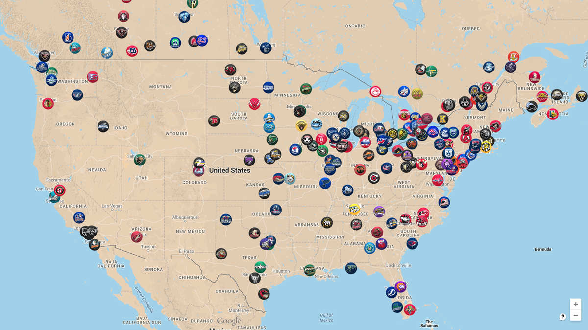

## Portfolio

### Marketing Analytics

[Chat Bot Sentiment Analysis](/bobchat-main/Bobchat_Report.html)

_Summary_ :
Created a report and model to gauge the effectiveness of a the NYU Chat Bot : "BobChat". I used data visualizations to determine the overall sentiment of the messages and the Chat Bot's effectiveness in answering. I created a sentiment analysis model to predict the sentiment of the message and performed a statistical analysis of the model's performance.  

---

### Hockey Data Science

Hockey has been a passion of mine my entire life, and now that I'm done playing I'm trying to find a way to fit it back into my professional life. I don't think you can grow up in Michigan in the late 90s, early 2000s and not be a hockey fan, but it probably didn't help that my Canadian grandmother was buying me skates at 2 years old.

[Expect Goals Logistic Model](/hockey/expectedGoalsModel.html)

_Summary_ :

Using 2015/2016 NHL Play By Play data I created an Expected Goals model which predicts the likelihood a shot will go in the net based on several factors. With this model I can determine if a player performed above or below their expected output for a game. The model is a multiple parameter logistic regression. 

---
[First Shift Experiment](/HockeyExperiments/firstShiftExperiment.html)

_Summary_ :
In trying to investigate the old hockey saying of "Catching your second wind" we discovered that there is no evidence to show that playing a long first shift will have a positive impact on the players goal output for that game. We this based this experiment on 2016 NHL season shift and goals data. In future iterations I would like to expand the experiment to points instead of just goals, and possibly other analytic metrics like corsi. I would also like to test if there is an impact on having a long shift at any point throughout the game and not just the first shift.

---
[Hockey Tryout Map](/tryoutMap/map.html)

_Summary_ :
Growing up I found it difficult to find hockey tryout information, where the team and tryout was located, find tryouts for different leagues, find tryouts near me for any leagues. This website is a solution to that problem. In its first iteration I scraped the website for the best junior league in the United States the United States Hockey League (USHL). After that I used Google Map Api and Folium to create an interactive map to display the markers with tryout information and location of all the teams. In future iterations I would like to add a second league (North American Hockey League - NAHL), use the location information for each tryout and team instead of just the team, and a webpage filter to limit the amount of teams shown by league.

---
[Coming Soon]

---

---

---

Page template forked from <a href="https://github.com/evanca/quick-portfolio">evanca</a>

<!-- Remove above link if you don't want to attibute -->